# Portl — Society Management App

A mobile-first society management platform that brings visitor approvals, security operations, community communication, amenity booking, and maintenance billing into one app for **Residents**, **Security Guards**, and **Society Admins**.

Built for the ChaiCode "Society Management App" hackathon track.

---

## The Problem

Apartment communities still run on gate calls, WhatsApp groups, paper registers, and manual approvals. A delivery partner reaches the gate, the guard calls the flat, the resident misses the call, the visitor waits — and the same slow pattern repeats for guests, staff, complaints, notices, and dues collection.

Portl replaces all of that with one mobile experience: the conversations that used to happen at the gate now happen inside the app, in real time.

---

## Download

📱 [Download APK (v1.0.0)](https://github.com/bvishal-27/portl/releases/download/v1.0.0/portl.apk) — 101 MB

Install directly on an Android device for the fastest way to see everything working — no setup required.

---

## Screenshots

| Authentication | Resident Home | Guest Pre-Approval |
|---|---|---|
| 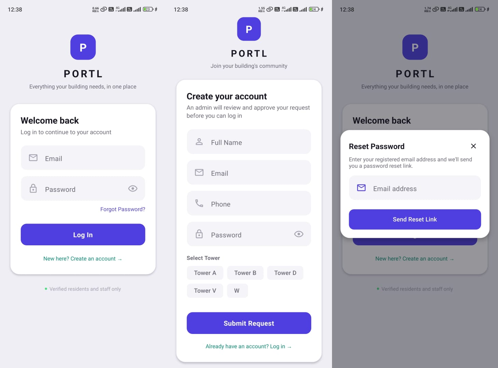 | 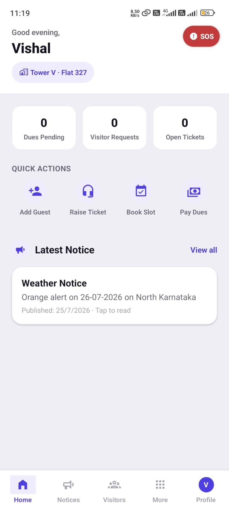 | 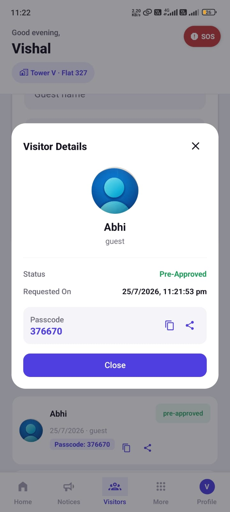 |

| Express Pass | Dues & PDF Invoice | Visitor History |
|---|---|---|
| 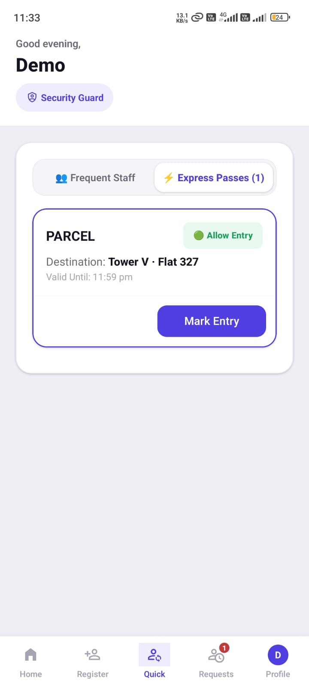 | 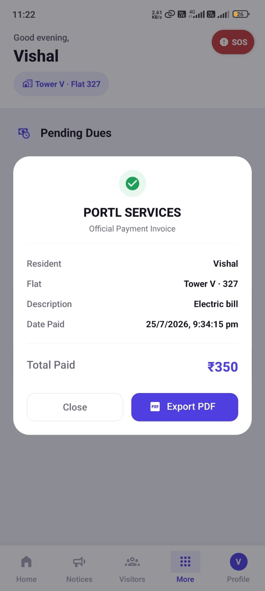 | 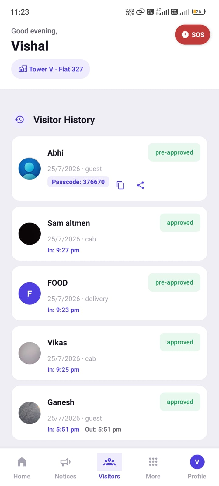 |

| Helpdesk Tickets | Guard Home | Register Visitor |
|---|---|---|
| 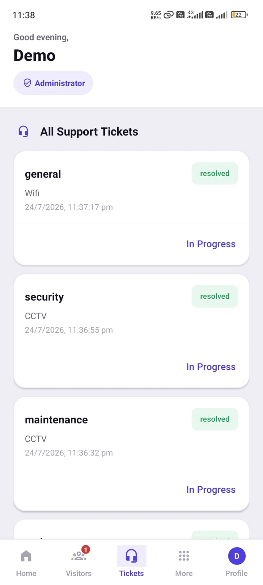 | 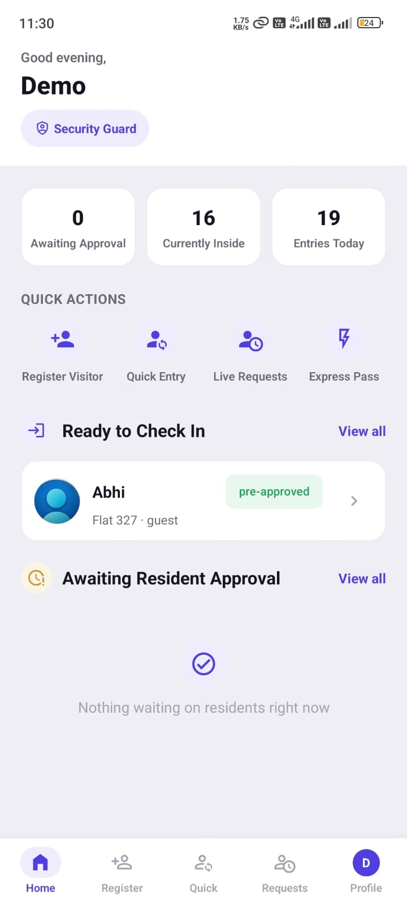 | 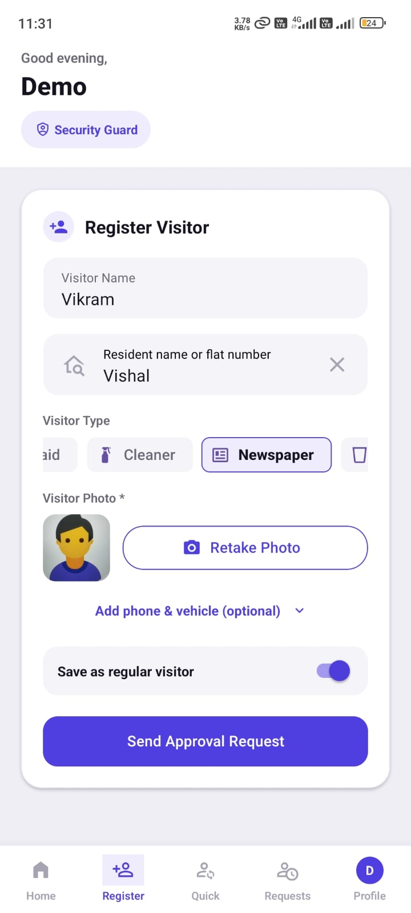 |

| Quick Entry (Frequent Staff) | SOS Alert | Admin Home |
|---|---|---|
| 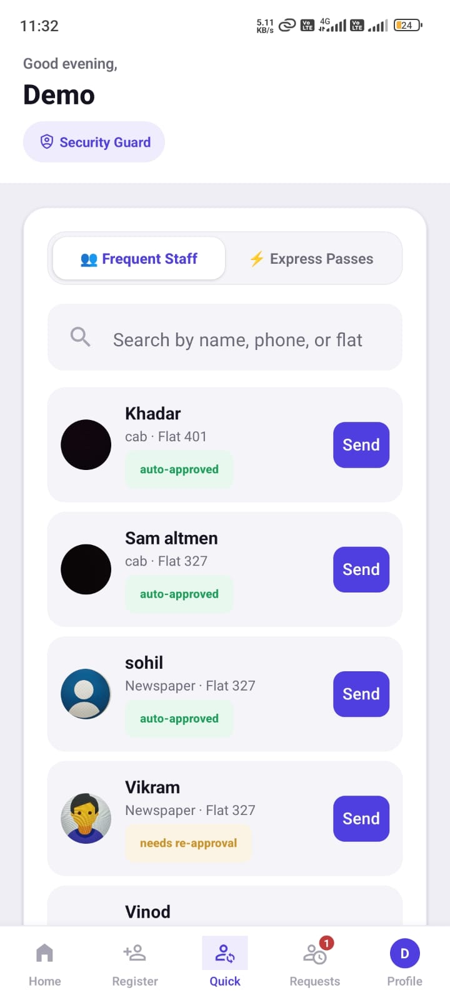 | 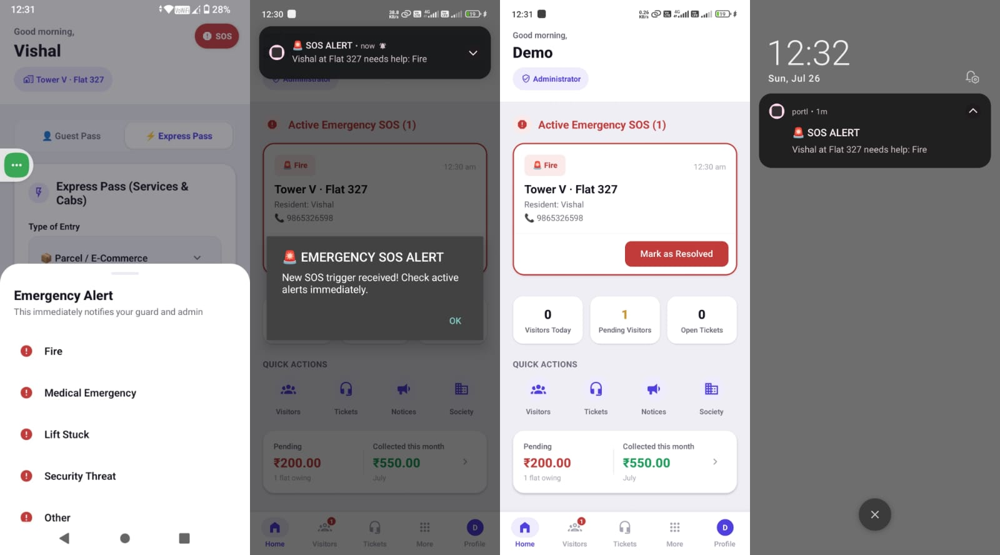 | 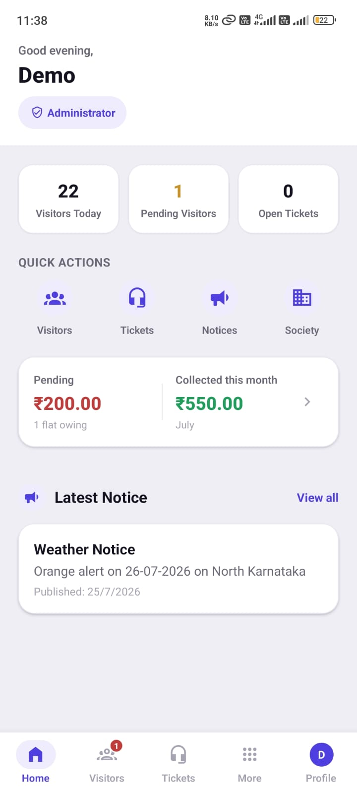 |


---

## Tech Stack

- **Framework:** Expo (SDK 54) + React Native + TypeScript
- **Navigation:** Expo Router (file-based routing)
- **Backend:** Supabase (PostgreSQL, Auth, Realtime, Storage, Edge Functions)
- **State Management:** Zustand (auth/session state) + React hooks with Supabase Realtime subscriptions for live data
- **Push Notifications:** Expo Notifications + Supabase Database Webhooks + Edge Function (Deno) calling the Expo Push API
- **PDF Generation:** expo-print + expo-sharing (digital payment invoices)
- **UI:** React Native Paper, custom design system
- **Media:** expo-image-picker, expo-file-system (visitor/staff photo capture and upload to Supabase Storage)

---

## Architecture

```
Expo React Native App
   ├── app/(auth)/          — Login, Signup,reset-password (self-registration with admin approval)
   ├── app/(resident)/      — Resident role: single-file screen with tab-based navigation
   ├── app/(guard)/         — Guard role: registration, quick entry, live requests
   ├── app/(admin)/         — Admin role: full society administration
   └── app/_layout.tsx      — Session bootstrap, push token registration, notification routing
         │
         ▼
Supabase (Postgres + Auth + Realtime + Storage)
   ├── Row Level Security (RLS) on every table — role-based access enforced at the database layer,
   │     not just in the UI (see is_admin() / is_guard() SECURITY DEFINER functions to avoid
   │     RLS recursion on the profiles table)
   ├── Realtime subscriptions — visitor requests, notices, polls, dues, SOS alerts all sync live
   │     across devices with zero polling
   └── Database Webhooks → Edge Function (Deno) → Expo Push API
         — fires automatically on new SOS alerts, notices, and polls. Visitor-request and
         pre-approval notifications are sent directly from the client app instead (see
         Notifications section below) to avoid double-firing alongside client-side sends.
```

---

## Role-Based Workflows

### 🔑 Authentication & Onboarding
- Residents self-register: full name, email, phone, password → select an admin-created **Tower** → select an admin-created **Flat** → submit request
- New accounts are created in a **pending** state and cannot log in until an admin approves them
- Admin sees all pending requests on their dashboard and can **Approve** or **Reject**
- Once approved, the resident logs in with the same email/password and lands on their dashboard
- Guard and Admin accounts are provisioned directly by the society (demo credentials below)
- All access is enforced with Postgres Row Level Security — a resident's queries are scoped to their own flat at the database level, not just hidden in the UI

### 🏠 Resident
Bottom navigation: **Home · Notices · Visitors · More · Profile**

- **Home** — quick stats (dues pending, visitor requests, open tickets), quick actions (Add Guest, Raise Ticket, Book Slot, Pay Dues, Express Pass), outstanding dues banner, latest notice preview, upcoming booking preview
- **Visitors tab** — two pre-approval modes:
  - **Guest Pass** — name, phone, photo → generates a 6-digit passcode. Passcode can be copied or shared directly via WhatsApp/SMS/any app. Guard verifies the code (or does a photo match as a fallback) at the gate to grant entry — no resident action needed at arrival time
  - **Express Pass** — for recurring delivery/cab services (food delivery, e-commerce parcels, cabs). Resident selects a service type and a validity window (1 hour / 2 hours / valid today / leave-at-gate-only) and generates a pass. Any matching delivery arriving within that window is let in by the guard with a single tap — no OTP, no new approval needed each time
  - **Pending Approvals** — live cards for guard-registered walk-in visitors, Approve/Deny in one tap
  - **Visitor History** — every past visitor with photo, type, status, and full entry/exit timestamps; tap any entry for full detail
- **Notices** — live-updating society announcement feed
- **Polls** — vote once per poll, see live results as votes come in
- **Helpdesk** — raise a ticket (general/maintenance/security/custom category), track status through open → in progress → resolved
- **Amenities** — browse amenities and time slots, book (double-booking prevented at the database level), cancel own bookings
- **Dues** — see pending maintenance dues, tap **Pay Now** (simulated payment — no real payment gateway per hackathon scope), automatically get a formatted digital invoice with **Export as PDF** for sharing/saving
- **Staff Directory** — view staff/service providers added by admin, tap to call directly
- **SOS button** (always visible) — Fire / Medical Emergency / Lift Stuck / Security Threat / Other. Sends an instant real-time alert with the resident's name, flat, and phone to every Guard and Admin app currently open (via Supabase Realtime); push-notification delivery for backgrounded/locked devices is planned but not yet wired up

### 🛡️ Security Guard
Bottom navigation: **Home · Register · Quick · Requests · Profile**

- **Home** — awaiting-approval count, currently-inside count, entries-today count, active SOS alerts front and center, quick actions
- **Register Visitor** — new walk-in visitors: name (3–15 characters, validated), resident/flat search with autocomplete, visitor type (guest/delivery/cab/service/regular-staff types/other), **mandatory photo capture**, optional phone (10-digit validated) and vehicle number, optional "save as regular visitor" toggle
- **Quick Entry** — two modes:
  - **Frequent Staff** — search saved regulars (maids, cleaners, milkman, drivers, newspaper, vegetable vendors, school bus) by name/phone/flat; tapping sends them straight through with auto-approval if their 30-day approval cycle hasn't expired (re-approval requested from the resident if it has), and logs entry immediately with a short "has entered" push instead of a fresh approval request
  - **Express Passes** — see all currently active resident-generated passes; one tap marks entry (or "Received at Gate" for leave-at-gate deliveries) — no OTP needed since the resident already pre-approved it. Guard-side list updates live via Supabase Realtime as soon as a resident creates a pass
- **Live Requests** — searchable by flat, with status filter always visible and visitor-type/tower filters available behind a "More filters" sheet. Every card shows photo, status, entry/exit times, and a live 30-minute countdown for undelivered parcels — automatically flagged **expired** past 30 minutes with a "Leave at Gate" fallback action, and the resident gets notified of the timeout
- Tapping any visitor opens a full detail modal: photo, destination flat, category, vehicle number, timestamps, and the relevant action (OTP verification, photo-verification fallback, Mark Entry, Mark Exit, or Leave at Gate)

### 🛠️ Society Admin
Bottom navigation: **Home · Visitors · Tickets · More · Profile**

- **Home** — active SOS alerts, today's visitor/ticket stats, dues collection snapshot (pending vs. collected this month), pending resident approvals, latest notice
- **Visitors** — full society-wide visitor log with status filters; admin can force-approve, force-deny, or delete any record
- **Tickets** — every resident helpdesk ticket, update status to In Progress / Resolved
- **Notices** — post title + body, all residents notified instantly; view and delete past notices
- **Polls** — create question + two options, residents notified and can vote live; delete polls
- **Amenities** — create amenities with capacity, view and cancel all bookings
- **Dues** — set a maintenance due (single flat or apply to all flats at once) with description, amount, and due date; view all dues and payment status across the society
- **Society** — full management of:
  - **Towers** — create/delete
  - **Flats** — create under a tower/delete
  - **Residents** — approve/reject signup requests, reassign a resident to a different flat, remove access entirely
  - **Staff Directory** — add staff/service providers with photo, type, and phone; residents can call them directly from their own app
- SOS alerts from any resident reach the admin in real time alongside the guard

---

## Real-Time & Notifications

Every list in the app (visitor requests, notices, polls, dues, SOS alerts, express passes) is backed by a Supabase Realtime subscription — updates appear instantly with no manual refresh, across every logged-in device simultaneously.

Push notifications come from two sources, split deliberately to avoid double-sends:

- **Sent directly from the client app** (guard/resident actions): new walk-in visitor request, guest pre-approval confirmation, regular/frequent visitor auto-entry, pre-approved guest's actual gate entry, delivery-timeout alert (once per request, race-safe via a "claim" update).
- **Sent via Supabase Database Webhook → Edge Function** (admin/system-level events): new notices, new polls.

SOS alerts are currently realtime-only (delivered instantly to any Guard/Admin app that's open, with no push fallback for a backgrounded or locked device) — closing that gap with either a webhook or a direct client-side push call is the next planned improvement.

New visitor requests also carry inline **Allow Entry / Deny Entry** action buttons directly on the resident's notification, so approval doesn't require opening the app. Each notification also carries routing data so tapping it opens the correct tab (Visitors, Notices, etc.) in the correct role's app instead of just landing on Home.

---

## Engineering Notes

- **Row Level Security everywhere.** Every table enforces access at the Postgres layer. Two `SECURITY DEFINER` helper functions (`is_admin()`, `is_guard()`) were introduced specifically to break RLS self-referential recursion on the `profiles` table while keeping policies simple and auditable.
- **Database-level integrity.** Amenity double-booking is prevented with a unique constraint, not just client-side checks. Deleting a flat with linked visitor/resident/due records is blocked with a clear, human-readable error instead of a raw database exception.
- **Single source of truth per notification type.** Visitor-request and pre-approval notifications are sent once, from the client, with no competing database trigger — this was a deliberate fix after an earlier version had both the client and a database webhook trying to notify on the same insert, causing duplicate pushes.
- **No real payment gateway** — intentionally out of scope for this hackathon. "Pay Now" simulates settlement and generates a real, shareable PDF invoice, matching the standard approach for hackathon submissions where payment integration isn't a stated requirement.

---

## Demo Credentials

| Role | Email | Password |
|---|---|---|
| Admin | `admin@portl.test` | `Portl@123` |
| Security Guard | `guard@portl.test` | `Portl@123` |
| Resident | `resident@portl.test` | `Portl@123` |
| Resident | `vishal@gmail.com` | `Vishal@123` |

A Tower and Flat are pre-seeded so the self-registration flow can also be tested end-to-end (sign up as a new resident, then log in as Admin to approve the request).

---

## Setup Instructions

1. Clone the repository and install dependencies:
   ```bash
   npm install --legacy-peer-deps
   ```
2. Create a Supabase project and run the SQL migration scripts (see `/supabase` in the repo) to set up tables, RLS policies, and the Realtime publication.
3. Create a `.env` file in the project root:
   ```
   EXPO_PUBLIC_SUPABASE_URL=your-supabase-url
   EXPO_PUBLIC_SUPABASE_ANON_KEY=your-supabase-anon-key
   ```
4. Deploy the Edge Function that sends push notifications for notices and polls:
   ```bash
   npx supabase functions deploy notify-events --no-verify-jwt
   ```
5. In the Supabase Dashboard, go to **Database → Webhooks** and create webhooks pointing to the deployed function's URL for:
   - `notices` — on **INSERT**
   - `polls` — on **INSERT**

   (Visitor-request and pre-approval pushes are sent directly from the app and do **not** need a webhook — do not attach one to `visitor_requests`, or you'll get duplicate notifications. `sos_alerts` does not have a webhook yet either — SOS is currently realtime-only; see the Notifications section above.)
6. Run the app:
   ```bash
   npx expo start
   ```
   Or install the provided APK directly on an Android device for the fastest way to see everything working.

---

## Submission Details

- **Project Name:** Portl
- **Track:** Society Management App
- **Description:** A mobile-first society management app (Expo + React Native + Supabase) that replaces gate calls and WhatsApp groups with real-time visitor approvals (including OTP guest passes and Express Passes for deliveries), guard operations, community notices/polls, helpdesk, amenity booking, maintenance dues with PDF invoicing, and an emergency SOS system — with distinct, permission-controlled dashboards for Residents, Security Guards, and Society Admins.
- **Tech Stack:** Expo, React Native, TypeScript, Supabase (Postgres, Auth, Realtime, Storage, Edge Functions), Expo Notifications, Expo Print
- **GitHub Repository:** https://github.com/bvishal-27/portl